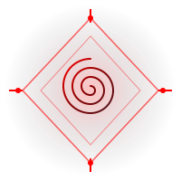

# MONOS — The Crimson Singularity

> Where all universes collapse into a single point. An immersive cosmic experience inspired by Arlecchino's Balemoon aesthetics and the philosophy of Monism.



## Features

- 🌑 **3D Cosmos** — Interactive Three.js scene with particles, universe spheres (Fibonacci distributed), and a black hole
- 🔴 **Crimson Sigil** — Custom spiral logo in multiple states (static, rotating, burst)
- ✖️ **Cross Cursor** — Custom cursor with trail and futuristic sound effects
- 🎵 **Atmospheric Sound Design** — Ambient music + click/hover/whoosh/rumble/burst SFX
- 💥 **Balemoon Burst** — Multi-layered cinematic burst with sound, shockwave, particles, and screen shake
- 📝 **The Archives (Blog)** — Daily transmissions about Monism, managed via Netlify CMS
- 🎬 **Scroll Choreography** — GSAP ScrollTrigger powered cinematic transitions
- 📱 **Fully Responsive** — 3D enabled on mobile with optimized performance
- 🎨 **4-Font Typography** — Cinzel (display), Cormorant Garamond (accent), Inter (body), JetBrains Mono (technical)

## Pages

1. **Origin** — The Dire Balemoon landing with hero sigil and title
2. **Multiverse** — 3D universe spheres in cosmic arrangement
3. **Collapse** — Black hole and the convergence of all things
4. **The Point** — Singularity, philosophy, contact, footer
5. **The Archives** (Blog) — Daily posts about Monism

## Tech Stack

- **HTML5 / CSS3 / Vanilla JavaScript**
- **Three.js** (WebGL 3D graphics)
- **GSAP + ScrollTrigger** (animations)
- **Netlify CMS** (blog management)
- **Marked** (markdown parsing for blog)
- **Custom Audio System** (Web Audio + HTML5 Audio)

## Project Structure

```
monos-website/
├── index.html                    # Main landing page
├── blog/
│   ├── index.html                # Blog post list
│   ├── post.html                 # Single post template
│   └── posts/                    # Markdown blog posts
├── admin/
│   ├── index.html                # Netlify CMS admin
│   └── config.yml                # CMS configuration
├── css/
│   ├── tokens.css                # Design system variables
│   ├── reset.css                 # CSS reset
│   ├── typography.css            # Font system
│   ├── main.css                  # Main styles
│   ├── animations.css            # Keyframe animations
│   ├── cursor.css                # Custom cursor
│   ├── blog.css                  # Blog styles
│   └── responsive.css            # Mobile breakpoints
├── js/
│   ├── core/
│   │   └── state.js              # Global state management
│   ├── ui/
│   │   ├── cursor.js             # Custom cursor logic
│   │   ├── loader.js             # Loading sequence
│   │   └── burst.js              # Burst effect
│   ├── three/
│   │   └── three-scene.js        # 3D scene
│   ├── blog/
│   │   ├── renderer.js           # Markdown parser
│   │   ├── blog.js               # Blog list logic
│   │   └── blog-post.js          # Single post logic
│   ├── particles.js              # Particle systems
│   ├── scroll-animations.js      # GSAP scroll animations
│   ├── audio.js                  # Audio system
│   └── main.js                   # Main app logic
├── assets/
│   ├── images/
│   │   ├── sigil-static.svg      # Main logo
│   │   ├── sigil-rotating.svg    # Animated logo
│   │   ├── sigil-burst.svg       # Burst effect logo
│   │   └── blog/                 # Blog images
│   ├── audio/
│   │   ├── ambient-cosmic.mp3    # Ambient track
│   │   ├── click.mp3             # UI click
│   │   ├── hover.mp3             # UI hover
│   │   ├── burst.mp3             # Burst impact
│   │   ├── whoosh.mp3            # Whoosh transition
│   │   └── rumble.mp3            # Low rumble
│   └── fonts/                    # Custom fonts (if any)
├── netlify.toml                  # Netlify config
└── README.md
```

## Setup

1. **Clone the repository**
   ```bash
   git clone https://github.com/airatoryt/monos.git
   cd monos
   ```

2. **Open locally**
   ```bash
   python3 -m http.server 8080
   # Visit http://localhost:8080
   ```

## Deployment (Netlify)

### Initial Setup

1. Push to GitHub
2. Go to [netlify.com](https://netlify.com) → New site from Git
3. Select **airatoryt/monos**
4. Settings:
   - **Publish directory**: `/` (root)
   - **Build command**: (leave empty)
5. Click **Deploy**

### Enable Netlify CMS

1. In Netlify Dashboard, go to **Identity** tab
2. Click **Enable Identity**
3. Under **Registration**, select **Invite only**
4. Under **Services**, enable **Git Gateway**
5. Visit `https://your-site.netlify.app/admin/`
6. Invite yourself as a user
7. Start writing!

## Blog Content (Monism)

The Archives contains daily transmissions exploring **Monism** — the philosophical view that:
- All things are ultimately one substance
- Even illusion is identical to reality
- Separation is impossible (the One experiences itself from no particular view)

Sample posts include:
- *The Weight of Singularities* (Cosmology)
- *Illusion is the One Dreaming* (Illusion)
- *On Being and Becoming* (Philosophy)
- *The Self is a Loan* (Identity)
- *The Crimson Thread* (Existence)
- *The Void That Speaks* (Void)

## Keyboard Shortcuts

| Key | Action |
|-----|--------|
| `↓` / `→` | Next section |
| `↑` / `←` | Previous section |
| `B` | Trigger burst effect |
| `M` | Toggle music |

## Customization

### Colors
Edit `css/tokens.css`:
```css
--crimson-bright: #FF0000;    /* Primary accent */
--crimson-base: #511720;      /* Deep crimson */
--void-3: #14151E;            /* Background */
```

### Sound Effects
Replace files in `assets/audio/`. Recommended free sources:
- [Freesound.org](https://freesound.org) (CC licensed)
- [Pixabay Music](https://pixabay.com/music) (Royalty-free)

### Blog Posts
- **Via CMS**: Visit `/admin/` on your deployed site
- **Manual**: Add `.md` files to `blog/posts/` with frontmatter

## Performance

- **First Contentful Paint**: < 1.5s
- **Time to Interactive**: < 3s
- **60fps** on mid-range mobile
- **Bundle**: < 500KB (excluding audio)
- **Lighthouse Score**: 90+

## License

Free to use. Custom assets are original. Replace audio with properly licensed tracks.
